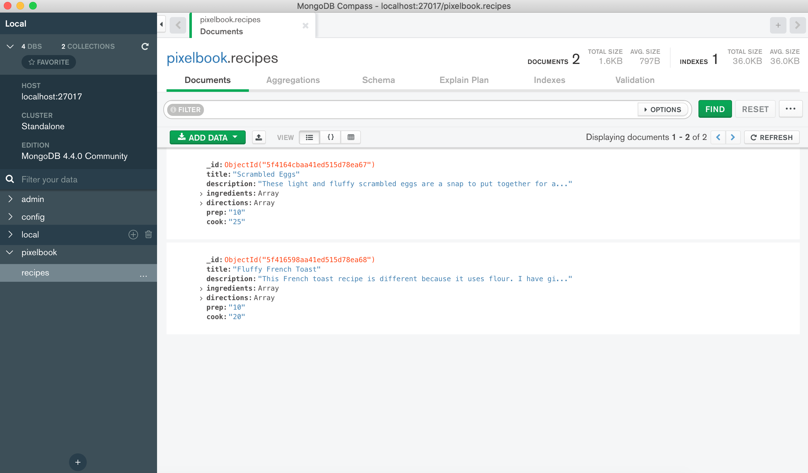

# Cook book web application

## Technologies

MERN Stack:
- MongoDB, as a database
- React.JS, as a frontend
- Node.JS, as a backend

## View

<p align="center">
  
</p>

## Quick start
```
npm i
npm run dev
```

It will run the app in the development mode.<br />
Open [http://localhost:3000](http://localhost:3000) to view it in the browser.

## MongoDB database

To be able to add recipes and save them in database you need to have:
1. Intalled MongoDB community on your PC
2. Active connection with MangoDB on port 27017
3. Structure of database needs to be the same as shown down below.

### Data structure



## Happy cooking!

### Sincerely yours, Levchenko Sonya


